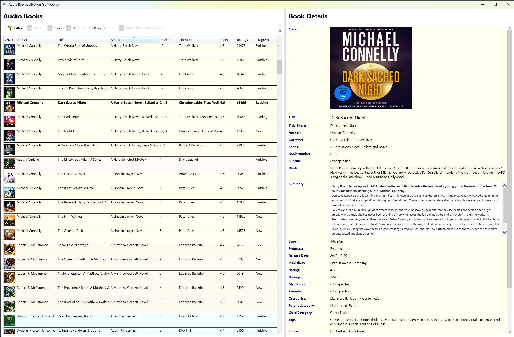

# Audio Book Collection Viewer

> **🤖 100% AI-Generated Application**  
> This entire application was written by AI (Cursor with Claude Sonnet 4.5) without a single line of code being manually edited by a human. Every feature, UI element, and piece of logic was implemented through natural language instructions to the AI assistant.



A C# WPF application to view and browse your audio book collection from CSV files.

## Features

- **Grid View**: Displays all audio books in a sortable grid with columns:
  - Author (150px width)
  - Title (flexible width)
  - Series (180px width) - automatically parsed to extract book number
  - Book # (70px width) - extracted from series information
  - Narrator (150px width)
  - Stars (60px width) - rating value
  - Ratings (70px width) - number of ratings
  - Progress (80px width) - reading status (New, Reading, Finished, Multiread)
- **Intelligent Series Parsing**: Automatically extracts book numbers from series information:
  - "The Dresden Files, Book 1" → Series: "The Dresden Files", Book #: "1"
  - "The Lord of the Rings, Book 0.5" → Series: "The Lord of the Rings", Book #: "0.5"
  - Book numbers are sorted **numerically** (1, 2, 3, 10) not alphabetically (1, 10, 2, 3)
- **Multi-Level Sorting**: Intelligent sorting with secondary and tertiary sort orders:
  - When sorted by **Author**: also sorts by Series, then Book #, then Title
  - When sorted by **Series**: also sorts by Book #, then Author, then Title
    - Books without a series always appear at the end (both ascending and descending)
  - When sorted by **Book #**: also sorts by Series, then Author, then Title
    - Empty book numbers always appear at the end
  - When sorted by **Title**: also sorts by Author, then Series
  - When sorted by **Narrator**: also sorts by Author, then Title
  - When sorted by **Stars**: also sorts by Ratings (descending - more popular first), then Title
    - Empty ratings always appear at the end
  - When sorted by **Ratings**: also sorts by Stars, then Title
    - Empty ratings count always appear at the end
  - When sorted by **Progress**: also sorts by Author, then Title
- **Author-Based Row Grouping**: When sorted by author, rows are shaded by author groups:
  - All books by the same author have the same background color
  - Alternates between white and light gray for each author
  - Makes it easy to visually distinguish between different authors
- **Advanced Filtering System**: Multiple mutually-exclusive filter options:
  - **≈ Author**: Filter books by the same author as the selected book
  - **≈ Series**: Filter books in the same series as the selected book
  - **≈ Narrator**: Filter books by the same narrator as the selected book
  - **Progress Dropdown**: Filter by reading status (All Progress, New, Reading, Finished, Multiread)
  - **Text Search**: Filter books by title or author name
  - All filters are mutually exclusive - activating one automatically clears the others
- **Detail View**: Shows complete information when a book is selected:
  - Title
  - Author
  - Series (if applicable)
  - Book Number (if applicable)
  - Narrator
  - **Text Selection**: All detail fields support text selection and copying to clipboard (Ctrl+C)
- **Responsive UI**: Resizable window with adjustable splitter between grid and details

## Requirements

- .NET 9.0 SDK or later
- Windows operating system

## Building and Running

### Using Visual Studio

1. Open `AudioBookViewer.csproj` in Visual Studio 2022 or later
2. Press F5 to build and run the application

### Using Command Line

1. Open PowerShell or Command Prompt
2. Navigate to the project directory
3. Run the following commands:

```bash
dotnet build
dotnet run
```

### Creating an Executable

To create a standalone executable:

```bash
dotnet publish -c Release -r win-x64 --self-contained true -p:PublishSingleFile=true
```

The executable will be in `bin\Release\net9.0-windows\win-x64\publish\`

## Usage

1. Launch the application
2. Browse the grid of audio books showing all columns (author, title, series, narrator, ratings, progress, etc.)
3. **Use filters** from the toolbar to narrow down your book list:
   - Select a book and click **≈ Author**, **≈ Series**, or **≈ Narrator** to see similar books
   - Choose a reading status from the **Progress** dropdown (New, Reading, Finished, Multiread)
   - Type in the **search box** to filter by title or author name
   - Click the **≈ icon** before the search box to clear the search
4. Click on any book row to view its complete details on the right
5. **Select and copy text** from the details panel:
   - Click and drag to select any text in the detail fields
   - Press Ctrl+C to copy selected text to clipboard
   - Right-click to access context menu for copy operations
6. **Sort by clicking column headers** (with intelligent multi-level sorting):
   - Click any header to sort by that column
   - Click the same header again to reverse the sort direction
   - Empty values always appear at the end of the list
   - When sorted by **Author**, rows are grouped with alternating background colors by author

## File Structure

- `AudioBook.cs` - Data model for audio book information with intelligent Progress mapping
- `MainWindow.xaml` - User interface layout with filter toolbar and sortable columns
- `MainWindow.xaml.cs` - Application logic, CSV parsing, filtering, and custom sorting comparers
- `App.xaml` - Application definition
- `App.xaml.cs` - Application entry point
- `AudioBookViewer.csproj` - Project configuration
- `ALE-spreadsheet-library-v1.csv` - Audio book data (must be in the same directory as the executable)
- `filter-icon.png` - Filter icon displayed in the toolbar

## Progress Status Mapping

The Progress column automatically maps CSV values to standardized statuses:
- **Empty** or **"(not Specified)"** → **New**
- **"New"** (case-insensitive) → **New**
- **"Reading"** (case-insensitive) → **Reading**
- **"Finished"** (case-insensitive) → **Finished**
- **"Multiread"** (case-insensitive) → **Multiread**
- **Any other text** (e.g., "1h 19m left") → **Reading**

## AI Development

This application serves as a demonstration of AI-powered software development capabilities:

- **100% AI-Generated Code**: Every line of code, XAML markup, and configuration was written by Claude Sonnet 4.5 through Cursor
- **No Manual Editing**: Not a single line was manually typed or edited by a human developer
- **Natural Language Development**: All features were implemented through conversational instructions
- **Iterative Refinement**: The AI handled bug fixes, feature additions, and UI improvements through dialogue
- **Complete Implementation**: Includes complex features like:
  - Multi-level sorting with custom comparers
  - Mutually exclusive filtering system
  - Dynamic UI updates and color-coding
  - Intelligent data mapping and parsing
  - Event handling and state management

This demonstrates that modern AI can handle full-stack application development from requirements to working software.

## Notes

- The CSV file (`ALE-spreadsheet-library-v1.csv`) must be present in the application directory for the app to work
- The project file is configured to automatically copy the CSV file to the output directory during build
- The application supports multiple CSV formats and will parse them intelligently


